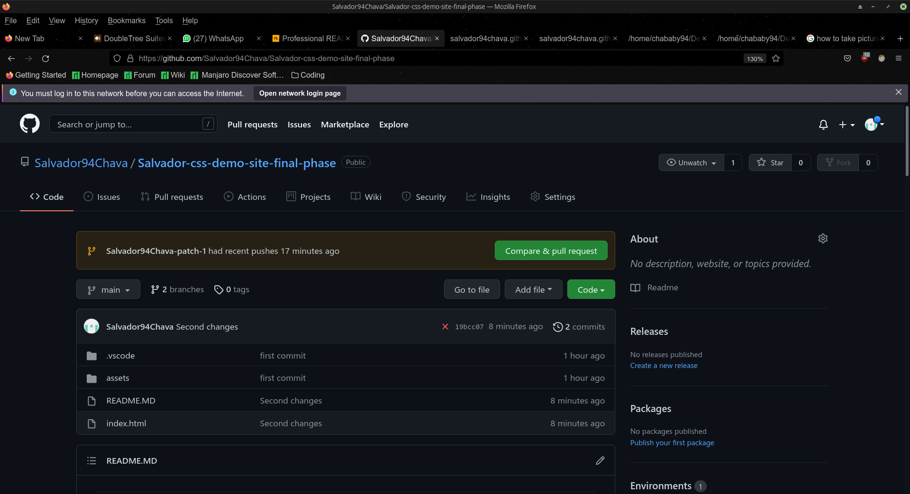

# <Homework-1-Horiseon>
## Description

this projects was requested by the customer, the customer stated that wanted to have the code refactored. (improving the code withoout changing what it does.)

My motivacion, was to have the customer satisfied with the following points.

*have a cleaner and more precise code. that will be helpful in the long run of the page.
*gave a clear view of the structure of the HTML elements.
*when we view the images even if there is no internet all of the images have a description of what they do.
*reworked the style.css, to have it working efficiently, (I noticed that a lot spam was made on Style.css so I left only the essential parts for the webpage.)
*I solved the first link of the webpage was not taged correcly I change it to ID after. so it worked as an actual hyperlink on the same webpage. Also there was a tag called span that didn't do anything and this was done on the header. I deleted it and left it without tags.
I learned to take my time and see slowly what was intended to happen in a set of code. and to ask myself what can I do to improve what it is already done.

# Table of Contents.
in the following spaces I will live links to make it easier for the reader. to find what it wants instead of reading everysingle paragraph.
- [Installation](#installation)
- [Usage](#usage)
- [Credits](#credits)
- [License](#license)
- [Links](#links)

# Installation
To run this project succesfuly one need to get into github https://github.com/Salvador94Chava/Salvador-css-demo-site-final-phase
and click on code, after that copy the https code or the ssh code and get on the terminal and type git clone and the link that was use to create a copy on the local machine.

here is a picture of the github account 

{width=800px height=100%}

also here are pictures of the Proyect on Github.

 {width=800px height=100%}


# links
file:///home/chababy94/Desktop/homework-2/index.html#online-reputation-managment

https://github.com/Salvador94Chava/Salvador-css-demo-site-final-phase

## Installation
What are the steps required to install your project? Provide a step-by-step description of how to get the development environment running.
## Usage
Provide instructions and examples for use. Include screenshots as needed.
To add a screenshot, create an `assets/images` folder in your repository and upload your screenshot to it. Then, using the relative filepath, add it to your README using the following syntax:
    ```md
    
    ```
## Credits
List your collaborators, if any, with links to their GitHub profiles.
If you used any third-party assets that require attribution, list the creators with links to their primary web presence in this section.
If you followed tutorials, include links to those here as well.
## License
The last section of a high-quality README file is the license. This lets other developers know what they can and cannot do with your project. If you need help choosing a license, refer to [https://choosealicense.com/](https://choosealicense.com/).
---
🏆 The previous sections are the bare minimum, and your project will ultimately determine the content of this document. You might also want to consider adding the following sections.
## Badges

Badges aren't necessary, per se, but they demonstrate street cred. Badges let other developers know that you know what you're doing. Check out the badges hosted by [shields.io](https://shields.io/). You may not understand what they all represent now, but you will in time.
## Features
If your project has a lot of features, list them here.
## How to Contribute
If you created an application or package and would like other developers to contribute it, you can include guidelines for how to do so. The [Contributor Covenant](https://www.contributor-covenant.org/) is an industry standard, but you can always write your own if you'd prefer.
## Tests
Go the extra mile and write tests for your application. Then provide examples on how to run them here.

A GitHub profile with consistently high-quality README files is sure to help you stand out among the crowd of developers putting their work on GitHub, so make sure you give these important files the time and attention they deserve.

This page was updated today 06/11/2021 (Day-Month-Year)